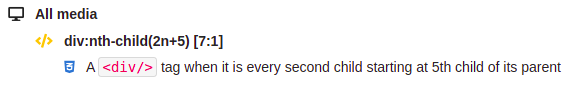
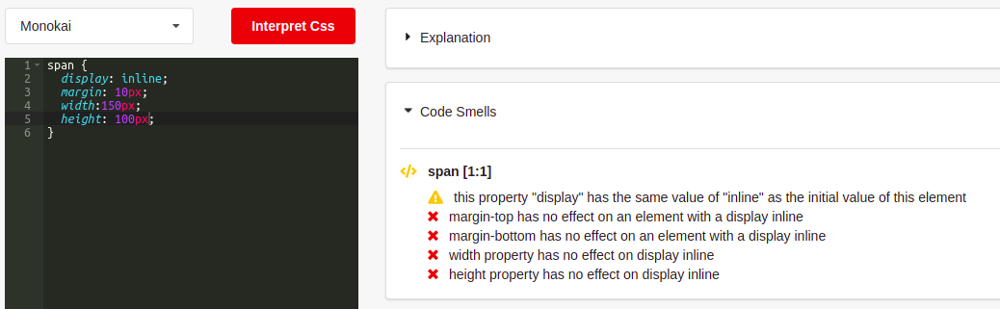

## Why we read selectors right to left?

### Short answer

Because the browser is doing the same!

### Long answer

Consider you have a `
` tag and the browser needs to check
if it matches the following declaration `.container > div p`,
it compares this `
` tag to its parent and start asking the following questions:

- Is this `
` descendent of a `
` tag?
- If yes, is this `
` a **_direct_** descendent
  of an element with `container` class?
- If yes, then this `
` is eligible to the declaration block
  `{ color: red, font-size: 1.3rem}`

On the other hand, we have two issues reading left to right:

1. These selectors will be evaluated in which scope?
2. Performance. Imagine the browser start to match
   a `.container` elements and start to climb down the DOM
   searching for direct `
` tag and then search for `
`
   tag as a child of the previous element, just to find out
   that this `.container` doesn't have a direct `
` or it
   has but doesn't have a `
` tag!

For more info on that matter I recommend checking this page on [CSS Tricks](https://css-tricks.com/why-browsers-read-selectors-right-to-left/)

## What stands out in our service?

### Code Explanation

1. We offer translating code into a human comprehensible language.
2. We support experimental and suggested features,
   while displaying a flag with the info.

   Examples of code explanation:

   - `.test::part() { }`

     

   - `.test:blank { }`

     

3. We support pseudo classes and elements taking selector list as an argument.

   Example:
   `p:not(.active) { }`

   

4. We support `nth` pseudo class selectors.

   Example:
   `div:nth-child(2n+5) { }`

   

5. We support media query explanation.

   Example:

   

### Code Smelling

We evaluate obsolete and contradictory declarations.

Here are some few examples of many:

- `span { margin: 10px }`

  The browser will not apply margin-top and margin-bottom
  on a `` in its initial display property.

- `div { position: absolute; display: block; }`

  `display: block` is obsolete as the element is in a `postilion: absolute`
  which will behave as a `block` element anyway.

- `div { margin: 2% }`

  We will simply show a warning here to alert the developer
  that padding and margin with percentage values
  are calculated compared to width of the parent!

  Example:

  
